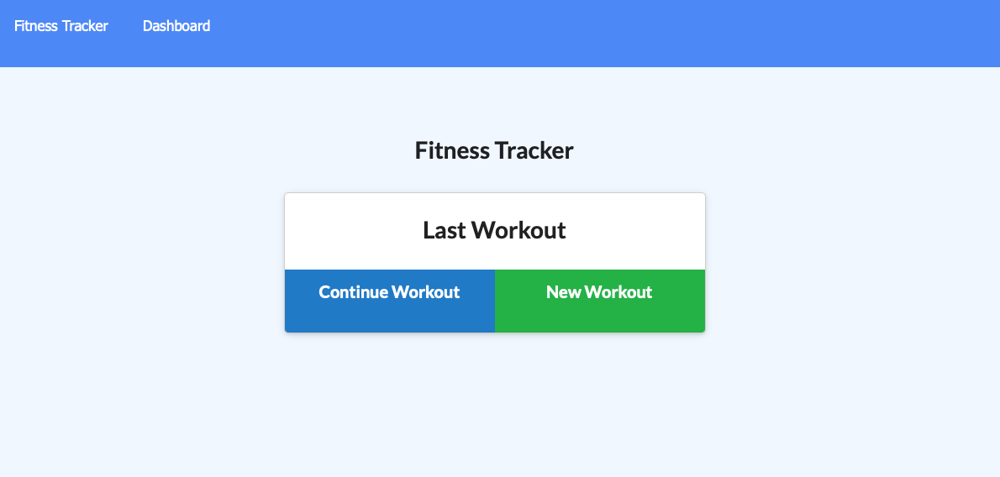

# fitness-tracker
### Created by: Ben Kasper

## Description
This is an application run to easily track, add, and update workout routines. It is deployed through Heroku (see link below) and will store your data in Mongo Atlas.

## Application Screenshots, Links and Demo

#### Screenshot

#### Link to the Github Repo
https://github.com/bckasper/fitness-tracker

#### Link to Heroku Application
https://fitnesstrackerbk.herokuapp.com

## Usage
1. User lands on home page and chooses to add a new workout
2. User fills out form for either a cardio or weights workout
3. When the user clicks add, the workout will be added to their database
4. The user can track and update these workouts as they progress through them.

## Technology used
The follow are assets that were used in creating this application:

- Mongo Atlas (Database)
- Heroku (Deployment)
- Express (Middleware)
- JavaScript, HTML and CSS programming languages

## Questions
Questions? Please visit my Github to view code and/or send me a message at https://github.com/bckasper
